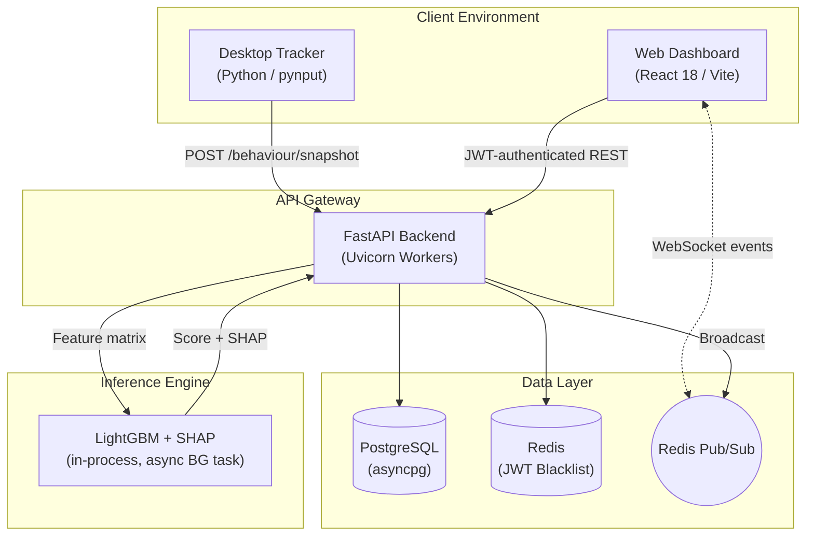
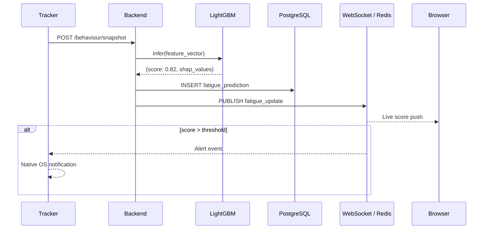

<div align="center">
  
  <h1>MindGuard</h1>
  <p><strong>Real-Time Mental Fatigue Detection through Privacy-Preserving Behavioral Analysis</strong></p>

  <p>
    <a href="https://github.com/SahanaK17/Real-Time-Mental-Fatigue-Detection/actions"></a>
    <a href="LICENSE"></a>
    <a href="https://github.com/SahanaK17/Real-Time-Mental-Fatigue-Detection/releases"></a>
    <a href="https://www.docker.com/"></a>
  </p>
  <p>
    
    
    
    
    
    
    
  </p>
</div>

---

MindGuard detects cognitive fatigue in real-time by measuring keyboard and mouse interaction dynamics — keystroke flight times, cursor velocity variance, and error correction rates — without ever recording the content of what is typed or capturing any screen data. A LightGBM classifier (F1: 0.937, Accuracy: 95.7%) identifies fatigue states from these behavioral signals and streams results live to a React dashboard via WebSocket.

Built as a privacy-first enterprise wellness platform. No webcam. No keylogging. No screen capture.

---

## Documentation

| Document | Description |
|:---|:---|
| [API Reference](docs/api/API.md) | All REST endpoints, request/response schemas, and WebSocket protocol |
| [Architecture](docs/architecture/ARCHITECTURE.md) | System design, data flow diagrams, security model, and scalability notes |
| [Deployment Guide](docs/deployment/DEPLOYMENT.md) | Docker, native deployment, Nginx configuration, and tracker distribution |
| [Developer Guide](docs/developer/DEVELOPER_GUIDE.md) | Local environment setup, ML pipeline, coding standards, and testing |
| [Changelog](CHANGELOG.md) | Full version history |
| [Security Policy](SECURITY.md) | Vulnerability disclosure process and security design principles |

---

## Interface Preview

<details open>
<summary><b>Application Screenshots</b></summary>
<br>

> Screenshots should be placed in `docs/images/`. The expected filenames are listed below.

| Real-Time Dashboard | Analytics |
|:---:|:---:|
|  |  |

| Predictions & SHAP Explainability | Authentication |
|:---:|:---:|
|  |  |

| Admin Panel | Live Monitoring |
|:---:|:---:|
|  |  |

</details>

---

## Features

### Privacy & Data Collection

| Feature | Implementation |
|:---|:---|
| **No content capture** | Raw keystrokes are discarded at the OS hook level. Only inter-event timing deltas and cursor displacement are buffered. |
| **Edge aggregation** | Statistical feature vectors (means, variances, rates) are computed locally on the user's device. Only the 24-element vector is transmitted. |
| **User control** | Tracking can be paused or stopped by the user at any time via the tracker CLI or dashboard. |

### Machine Learning

| Feature | Implementation |
|:---|:---|
| **Explainable AI** | SHAP `TreeExplainer` provides per-prediction feature contribution scores, showing which behaviors triggered a fatigue alert. |
| **Model selection** | LightGBM selected from a competitive evaluation of 5 classifiers on a 150k-record synthetic dataset. |
| **Real-time inference** | Model is loaded into memory at startup. Inference runs as a FastAPI background task to avoid blocking the async event loop. |

### Platform

| Feature | Implementation |
|:---|:---|
| **WebSocket streaming** | Per-user authenticated WebSocket channels stream fatigue scores live. Redis Pub/Sub enables horizontal scaling across multiple backend workers. |
| **Role-based access** | Employee and admin roles. Admin panel provides team-wide fatigue monitoring, high-risk user identification, and CSV/PDF report export. |
| **Graceful degradation** | Redis is optional. If unavailable, the backend operates without caching and WebSockets fall back to single-node in-memory delivery without service interruption. |

---

## System Architecture



## Data Flow



---

## Technology Stack

| Layer | Technology | Purpose |
|:---|:---|:---|
| **Frontend** | React 18, TypeScript, TailwindCSS v4, Zustand, Recharts | Reactive dashboard, state management, and data visualization |
| **Backend** | FastAPI, Python 3.11+, Pydantic v2 | Async REST API, WebSocket termination, schema validation |
| **Database** | PostgreSQL 16, SQLAlchemy 2.0 (async) | ACID-compliant persistent storage |
| **Cache & Pub/Sub** | Redis 7 | Token blacklisting, WebSocket horizontal scaling |
| **Machine Learning** | LightGBM, SHAP, scikit-learn | Classification, model serialization, explainability |
| **Data Collection** | pynput, plyer | OS-level input hooks, native desktop notifications |
| **Deployment** | Docker, Docker Compose, Nginx, Uvicorn | Containerized orchestration, reverse proxying |

---

## Machine Learning

### Model Evaluation Results

Trained on a 150,000-record synthetic dataset with an 80/20 train-test split.

| Model | Test F1 | Test Accuracy | Test AUC |
|:---|:---:|:---:|:---:|
| **LightGBM** ✅ | **0.9373** | **95.72%** | 0.587 |
| XGBoost | 0.9370 | 95.70% | 0.581 |
| Random Forest | 0.9225 | 92.01% | 0.569 |
| SVM | 0.8341 | 76.87% | 0.540 |
| Logistic Regression | 0.7481 | 64.29% | 0.604 |

> **Note:** Results are from the synthetic dataset. Performance on real-world production data may differ. Cross-validation F1 scores were suppressed due to class imbalance in the CV splits; test set metrics are the reliable comparators.

### Feature Engineering (24 features)

| Domain | Features |
|:---|:---|
| **Typing kinematics** | `typing_speed_wpm`, `key_hold_time_ms`, `flight_time_ms`, `error_rate`, `typing_rhythm_variance`, `typing_burst_score`, `idle_time_keyboard_s` |
| **Mouse kinematics** | `mouse_speed_px_s`, `mouse_acceleration`, `direction_changes`, `click_frequency`, `hover_duration_ms`, `double_click_count`, `idle_time_mouse_s` |
| **Contextual** | `hour_of_day`, `day_of_week`, `session_duration_minutes`, derived fatigue-state labels |

---

## Quick Start

### Requirements

- Docker 24+ and Docker Compose 2+
- Python 3.11+ (for the Desktop Tracker)

### 1. Clone and configure
```bash
git clone https://github.com/SahanaK17/Real-Time-Mental-Fatigue-Detection.git
cd Real-Time-Mental-Fatigue-Detection
cp .env.example .env
# Edit .env — replace SECRET_KEY and JWT_SECRET_KEY with strong random values
```

### 2. Start the full stack
```bash
docker-compose up --build -d
docker-compose ps   # verify all services are healthy
```

| Service | URL |
|:---|:---|
| Dashboard | `http://localhost:80` |
| API | `http://localhost:8002/api/v1` |
| Swagger Docs | `http://localhost:8002/docs` |

### 3. Generate training data and train the model
```bash
python dataset/generator.py --rows 150000 --output dataset/generated/fatigue_data.csv
python scripts/train_models.py --data dataset/generated/fatigue_data.csv --output ml/models/
```

### 4. Start the Desktop Tracker
```bash
cd tracker
pip install -r requirements.txt
python main.py --email alice@company.com --password Password123 --api-url http://localhost:8002
```

The tracker will authenticate, start a session, and begin streaming behavioral feature snapshots to the backend every second.

---

## Performance Targets

> These are design targets. Actual benchmark values should be measured after deployment and profiling under representative load.

| Metric | Target |
|:---|:---:|
| API Latency (p95) | < 50ms |
| ML Inference Time | < 10ms |
| WebSocket Fan-out Latency | < 100ms |
| Model F1 (production data) | > 0.85 |

---

## Roadmap

- [x] JWT authentication with refresh token rotation
- [x] Behavioral data ingestion and real-time ML inference
- [x] WebSocket live score streaming (Redis Pub/Sub)
- [x] React dashboard with charts and heatmaps
- [x] Admin panel with CSV/PDF export
- [x] SHAP explainability per prediction
- [x] Docker Compose full-stack deployment
- [ ] Enterprise SSO (SAML 2.0 / OAuth2)
- [ ] Kubernetes Helm charts
- [ ] Standalone Tracker installer (Tauri / Electron)
- [ ] Organization and team grouping
- [ ] Configurable per-user fatigue baseline calibration period

---

## Contributing

Contributions are welcome. Please read [CONTRIBUTING.md](CONTRIBUTING.md) before opening a pull request. All contributors are expected to follow the [Code of Conduct](CODE_OF_CONDUCT.md).

---

## License

Distributed under the MIT License. See [LICENSE](LICENSE) for details.

---

<div align="center">
  <b>Built and maintained by <a href="https://github.com/SahanaK17">Sahana K.</a></b>
  &nbsp;·&nbsp;
  <a href="SECURITY.md">Security Policy</a>
  &nbsp;·&nbsp;
  <a href="CHANGELOG.md">Changelog</a>
</div>
