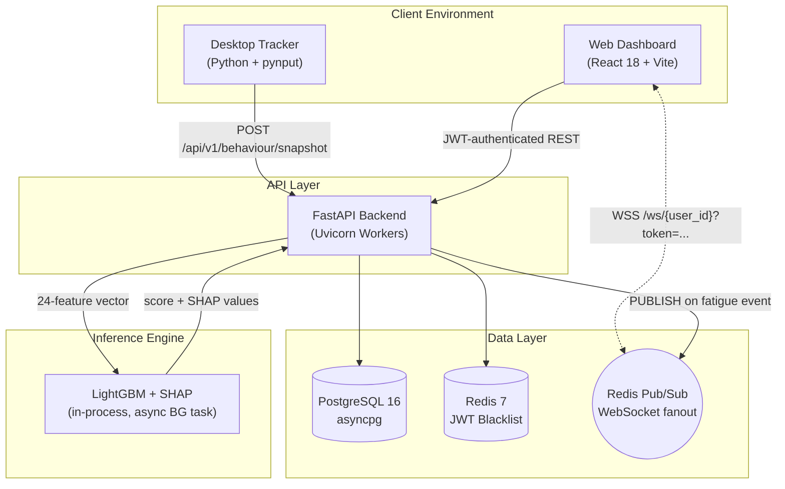
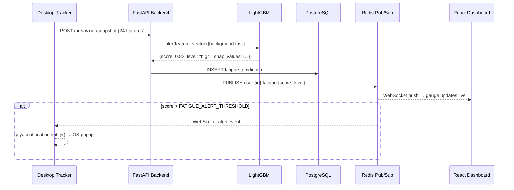
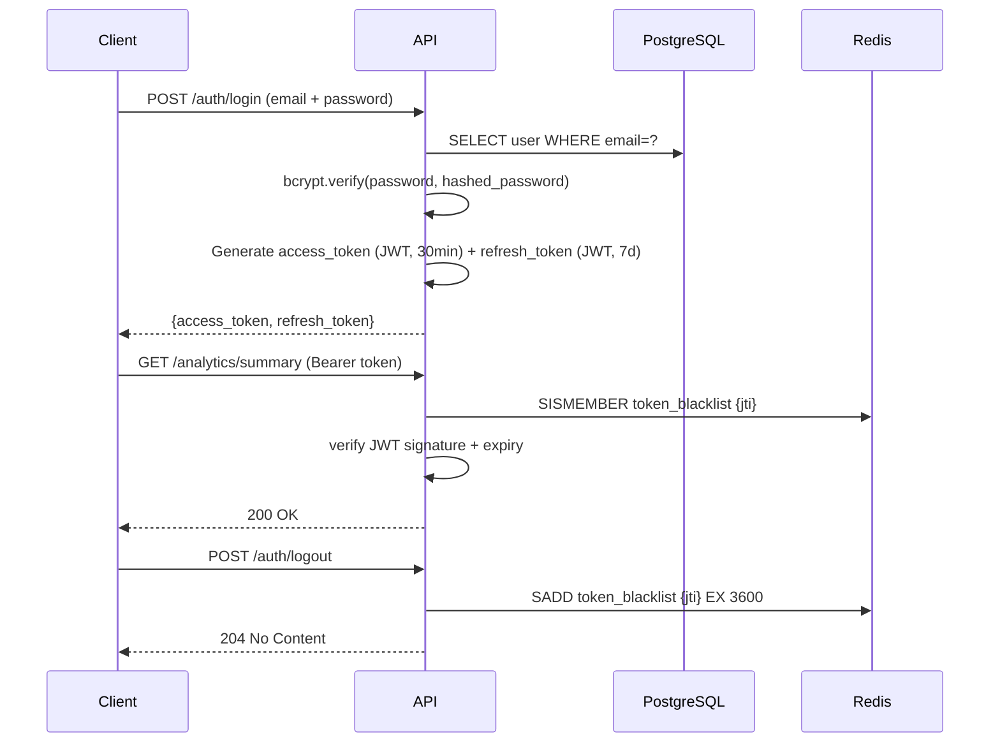

<div align="center">

# MindGuard

### Real-Time Mental Fatigue Detection via Privacy-Preserving Behavioral Analysis

*Detects cognitive exhaustion by analyzing keystroke dynamics and cursor kinematics — no webcam, no keylogging, no screen capture.*

<br/>

[](https://github.com/SahanaK17/Real-Time-Mental-Fatigue-Detection/actions/workflows/ci.yml)
[](LICENSE)
[](https://python.org)
[](https://react.dev)
[](https://fastapi.tiangolo.com)
[](docker-compose.yml)

</div>

---

## Executive Summary

MindGuard is a full-stack enterprise wellness platform that continuously monitors employee cognitive fatigue during work sessions. A lightweight Python desktop agent collects keyboard and mouse behavioral signals, extracts 24 statistical features per second, and transmits them to a FastAPI backend. A LightGBM classifier (F1: **0.937**, Accuracy: **95.7%** on synthetic test data) scores each window and streams the result to a React dashboard via WebSocket.

The system is designed around one constraint: **zero content surveillance**. Raw keystrokes are discarded at the OS hook level. Only timing intervals and cursor displacement statistics cross the network.

---

## Quick Links

| | |
|:---|:---|
| 📡 **API Reference** | [docs/api/API.md](docs/api/API.md) |
| 🏗️ **Architecture** | [docs/architecture/ARCHITECTURE.md](docs/architecture/ARCHITECTURE.md) |
| 🚀 **Deployment** | [docs/deployment/DEPLOYMENT.md](docs/deployment/DEPLOYMENT.md) |
| 🛠️ **Developer Guide** | [docs/developer/DEVELOPER_GUIDE.md](docs/developer/DEVELOPER_GUIDE.md) |
| 🤖 **Model Details** | [docs/MODEL_DETAILS.md](docs/MODEL_DETAILS.md) |
| 📊 **Dataset** | [docs/DATASET.md](docs/DATASET.md) |
| 🗺️ **Roadmap** | [docs/ROADMAP.md](docs/ROADMAP.md) |
| ❓ **FAQ** | [docs/FAQ.md](docs/FAQ.md) |
| 🔒 **Security Policy** | [SECURITY.md](SECURITY.md) |

---

## Interface Preview

> Screenshots are captured from the live running application. Place images in `docs/images/` with the filenames below to populate this gallery.

<details open>
<summary><b>Application Screenshots</b></summary>
<br/>

| Real-Time Dashboard | Live Fatigue Monitoring |
|:---:|:---:|
| `docs/images/dashboard.png` | `docs/images/live-monitoring.png` |

| Analytics & Trends | SHAP Explainability |
|:---:|:---:|
| `docs/images/analytics.png` | `docs/images/prediction.png` |

| Admin Panel | Authentication |
|:---:|:---:|
| `docs/images/admin.png` | `docs/images/login.png` |

</details>

---

## Key Features

### Privacy-First Data Collection
- **No keystroke content** — only timing deltas and displacement magnitudes
- **Edge aggregation** — statistical features computed on-device; only 24 floats transmitted per second
- **User control** — tracking paused or stopped at any time via CLI or dashboard

### Machine Learning Pipeline
- LightGBM classifier evaluated against XGBoost, Random Forest, SVM, and Logistic Regression
- **SHAP `TreeExplainer`** returns per-prediction feature contributions — every score is explainable
- **Heuristic fallback** — rule-based scoring when the ML model is not loaded (labeled transparently in API responses)
- Full retraining pipeline in `scripts/train_models.py`

### Production Backend
- **Async throughout** — FastAPI + SQLAlchemy 2.0 async + asyncpg
- **JWT authentication** with refresh token rotation; logout immediately blacklists the JTI in Redis
- **Redis Pub/Sub WebSocket scaling** — backend is stateless; any number of Uvicorn workers can handle any user's connection
- **Rate limiting** — SlowAPI middleware (60 req/min general, 10 req/min on auth endpoints)
- **Audit trail** — immutable `AuditLog` table tracks all authentication events

### Full Observability
- `structlog` structured JSON logging throughout
- `/health` endpoint reporting status of all dependencies
- SHAP explanations stored per-prediction in PostgreSQL

---

## System Architecture



---

## Data Flow



---

## Technology Stack

| Layer | Technology | Version | Purpose |
|:---|:---|:---:|:---|
| **Frontend** | React, TypeScript | 18 / 5.x | Reactive dashboard |
| | TailwindCSS | 4 | Utility-first styling |
| | Zustand | 4.x | Global auth & fatigue state |
| | Recharts | 2.x | Data visualization |
| | Framer Motion | 11.x | Micro-animations |
| **Backend** | FastAPI | 0.111 | Async REST API |
| | Pydantic v2 | 2.7 | Schema validation |
| | SQLAlchemy | 2.0 | Async ORM |
| | python-jose | 3.3 | JWT handling |
| | passlib/bcrypt | 1.7 | Password hashing |
| | structlog | 24.x | Structured logging |
| | SlowAPI | 0.1 | Rate limiting |
| **Database** | PostgreSQL | 16 | Persistence |
| | Redis | 7 | Token blacklist, Pub/Sub |
| **ML** | LightGBM | 4.3 | Fatigue classification |
| | SHAP | 0.45 | Prediction explainability |
| | scikit-learn | 1.4 | Preprocessing, evaluation |
| **Tracker** | pynput | 1.7 | OS input hooks |
| | plyer | 2.1 | Native OS notifications |
| **Infra** | Docker + Compose | 24+ | Containerization |
| | Nginx | alpine | Reverse proxy |
| | Uvicorn | 0.29 | ASGI server |

---

## Project Structure

```
mindguard/
├── .github/
│   ├── workflows/ci.yml          # GitHub Actions CI pipeline
│   ├── ISSUE_TEMPLATE/           # Bug report & feature request templates
│   └── PULL_REQUEST_TEMPLATE.md
│
├── backend/
│   ├── app/
│   │   ├── api/v1/endpoints/     # Route handlers (auth, behaviour, analytics, admin…)
│   │   ├── core/                 # Config, security, Redis, exceptions, logging
│   │   ├── db/                   # SQLAlchemy models, session management
│   │   ├── ml/                   # Inference engine (ModelRegistry + SHAP)
│   │   ├── schemas/              # Pydantic request/response schemas
│   │   ├── services/             # Business logic layer
│   │   └── websocket/            # Redis Pub/Sub connection manager
│   ├── tests/                    # pytest test suite
│   └── requirements.txt
│
├── frontend/
│   └── src/
│       ├── api/                  # Axios clients & interceptors
│       ├── components/           # Reusable UI components
│       ├── hooks/                # useWebSocket, useFatigue, etc.
│       ├── pages/                # Dashboard, Auth, Admin, Analytics
│       └── store/                # Zustand global state
│
├── tracker/
│   ├── keyboard_collector.py     # Keystroke timing aggregation
│   ├── mouse_collector.py        # Mouse kinematics aggregation
│   ├── aggregator.py             # Feature engineering & 1-second windowing
│   └── main.py                   # CLI entry point
│
├── dataset/
│   └── generator.py              # Synthetic behavioral data generator
│
├── scripts/
│   ├── train_models.py           # Full ML training & evaluation pipeline
│   ├── seed_db.py                # Development database seeder
│   └── init_db.sql               # PostgreSQL initialization script
│
├── ml/
│   └── models/                   # Serialized artifacts (not committed to VCS)
│       ├── best_model.joblib
│       ├── scaler.joblib
│       ├── feature_names.json
│       └── training_report.json
│
├── docs/
│   ├── api/API.md
│   ├── architecture/ARCHITECTURE.md
│   ├── deployment/DEPLOYMENT.md
│   ├── developer/DEVELOPER_GUIDE.md
│   ├── MODEL_DETAILS.md
│   ├── DATASET.md
│   ├── ROADMAP.md
│   └── FAQ.md
│
├── docker/                        # Dockerfiles & Nginx config
├── docker-compose.yml
├── .env.example
└── ruff.toml                      # Python linter configuration
```

---

## Machine Learning

### Model Evaluation (Synthetic Dataset, 150k samples)

| Model | Test F1 | Test Accuracy | Test AUC-ROC |
|:---|:---:|:---:|:---:|
| **LightGBM** ✅ | **0.9373** | **95.72%** | 0.587 |
| XGBoost | 0.9370 | 95.70% | 0.581 |
| Random Forest | 0.9225 | 92.01% | 0.569 |
| SVM | 0.8341 | 76.87% | 0.540 |
| Logistic Regression | 0.7481 | 64.29% | 0.604 |

> **Transparency note:** These results are from a synthetic dataset. Real-world performance requires validation against labeled real behavioral data. The cross-validation F1 scores in `training_report.json` are anomalously low due to a class imbalance artifact in the CV splits — the test set F1 scores are the reliable metric. See [Model Details](docs/MODEL_DETAILS.md) for a complete explanation.

### SHAP Explainability

Every prediction returns a structured SHAP explanation:

```json
{
  "fatigue_score": 0.82,
  "fatigue_level": "high",
  "confidence": 0.91,
  "top_features": [
    { "feature": "error_rate", "shap_value": 0.142, "impact": "increases" },
    { "feature": "idle_time_keyboard_s", "shap_value": 0.098, "impact": "increases" },
    { "feature": "typing_speed_wpm", "shap_value": -0.073, "impact": "decreases" }
  ]
}
```

---

## Quick Start

### Prerequisites
- Docker 24+ and Docker Compose 2+
- Python 3.11+ (for the Desktop Tracker)

### 1. Clone and configure

```bash
git clone https://github.com/SahanaK17/Real-Time-Mental-Fatigue-Detection.git
cd Real-Time-Mental-Fatigue-Detection
cp .env.example .env
```

Edit `.env` and generate strong random secrets:

```bash
python -c "import secrets; print(secrets.token_hex(32))"
```

Replace `SECRET_KEY` and `JWT_SECRET_KEY` with the outputs.

### 2. Generate training data and train the model

```bash
# Generate 150,000 synthetic behavioral observations (~80MB)
python dataset/generator.py --rows 150000 --output dataset/generated/fatigue_data.csv

# Train all models; best is saved to ml/models/
python scripts/train_models.py
```

### 3. Start the full stack

```bash
docker-compose up --build -d
docker-compose ps    # all services should show healthy
```

| Service | URL |
|:---|:---|
| Web Dashboard | http://localhost:80 |
| API (JSON) | http://localhost:8002/api/v1 |
| API Docs (Swagger) | http://localhost:8002/docs |

### 4. Seed demo data (optional)

```bash
docker exec -it mf_backend python scripts/seed_db.py
```

### 5. Start the Desktop Tracker

```bash
cd tracker
pip install -r requirements.txt
python main.py \
  --email alice@company.com \
  --password Password123 \
  --api-url http://localhost:8002
```

---

## API Overview

**Base URL:** `/api/v1`  
**Authentication:** `Authorization: Bearer <access_token>` (except `/auth/signup` and `/auth/login`)

| Method | Endpoint | Description |
|:---|:---|:---|
| `POST` | `/auth/signup` | Register a new user account |
| `POST` | `/auth/login` | Authenticate (OAuth2 Password Flow) |
| `POST` | `/auth/refresh` | Exchange refresh token for new access token |
| `POST` | `/auth/logout` | Revoke token (Redis JTI blacklist) |
| `GET` | `/auth/me` | Get authenticated user profile |
| `POST` | `/sessions/start` | Start a tracking session |
| `POST` | `/sessions/end` | End the current session |
| `POST` | `/behaviour/snapshot` | Submit a 1-second feature vector for inference |
| `POST` | `/behaviour/batch` | Submit multiple snapshots (sync after offline) |
| `GET` | `/analytics/summary` | Dashboard KPI summary |
| `GET` | `/analytics/daily` | Hourly fatigue trend |
| `GET` | `/analytics/heatmap` | Day × hour fatigue intensity matrix |
| `GET` | `/predictions/latest` | Most recent ML prediction |
| `GET` | `/admin/users` | Paginated user list (admin only) |
| `GET` | `/admin/export/csv` | Streaming CSV export (admin only) |
| `WS` | `/ws/{user_id}?token=` | Real-time fatigue score stream |

Full schema documentation: [docs/api/API.md](docs/api/API.md)

---

## Authentication Flow



---

## Redis Architecture

Redis serves two distinct roles:

| Role | Key Pattern | TTL | Purpose |
|:---|:---|:---:|:---|
| **Token Blacklist** | `token_blacklist` (Redis Set) | Token expiry | Immediate JWT revocation on logout |
| **WebSocket Pub/Sub** | `user:{user_id}:fatigue` | — | Broadcast fatigue events to any worker |

This design makes the backend **fully stateless** with respect to WebSocket connections. Any Uvicorn worker can subscribe to any user's channel and deliver the message to the connected client — no sticky sessions or worker affinity required.

---

## Running Tests

```bash
# Backend tests (requires Python 3.11+)
cd backend
pytest tests/ -v --cov=app --cov-report=term-missing

# Frontend type check
cd frontend && npx tsc --noEmit

# Frontend lint
cd frontend && npm run lint
```

---

## Deployment

See [Deployment Guide](docs/deployment/DEPLOYMENT.md) for Docker, native Gunicorn, and Nginx configuration.

**One-line Docker start:**
```bash
docker-compose up --build -d
```

**Environment variable checklist before production:**
- [ ] `SECRET_KEY` — ≥ 32 random hex characters
- [ ] `JWT_SECRET_KEY` — ≥ 32 random hex characters
- [ ] `POSTGRES_PASSWORD` — strong random password
- [ ] `REDIS_PASSWORD` — strong random password
- [ ] `CORS_ORIGINS` — set to your frontend domain only
- [ ] `APP_ENV=production`
- [ ] `DEBUG=false`

---

## Security

- Passwords hashed with **bcrypt** (work factor 12)
- JWTs verified on every request; logout immediately blacklists the token JTI
- CORS restricted to an explicit allowlist
- Rate limiting: 60 req/min general, 10 req/min on auth endpoints
- All request bodies validated against strict Pydantic schemas
- No raw keystrokes, cursor coordinates, or screen content ever stored

See [SECURITY.md](SECURITY.md) for the vulnerability disclosure process.

---

## Future Improvements

See the full [Roadmap](docs/ROADMAP.md). Key items:

- **v1.1:** Per-user baseline calibration, fix CV F1 anomaly, integration test coverage gate
- **v2.0:** IRB participant study for real-world data, SAML 2.0 SSO, Kubernetes Helm charts
- **v3.0+:** Federated learning, wearable integration, mobile companion app

---

## Contributing

Contributions are welcome. Read [CONTRIBUTING.md](CONTRIBUTING.md) before opening a pull request. All contributors are expected to follow the [Code of Conduct](CODE_OF_CONDUCT.md).

---

## License

Distributed under the MIT License. See [LICENSE](LICENSE) for details.

---

<div align="center">
  Built by <a href="https://github.com/SahanaK17"><strong>Sahana K.</strong></a>
  &nbsp;·&nbsp;
  <a href="SECURITY.md">Security Policy</a>
  &nbsp;·&nbsp;
  <a href="CHANGELOG.md">Changelog</a>
  &nbsp;·&nbsp;
  <a href="docs/FAQ.md">FAQ</a>
</div>
