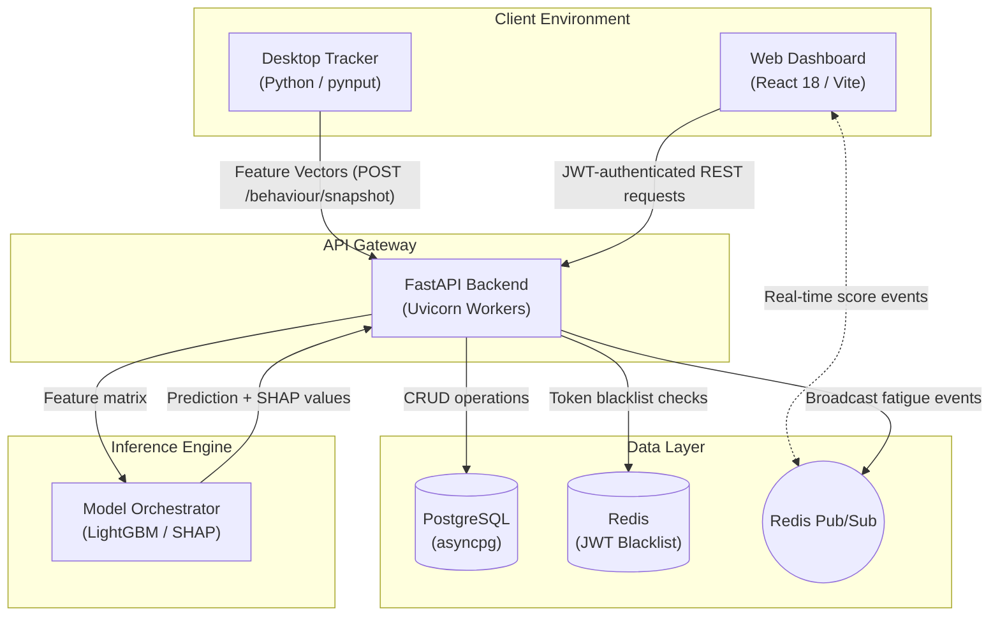
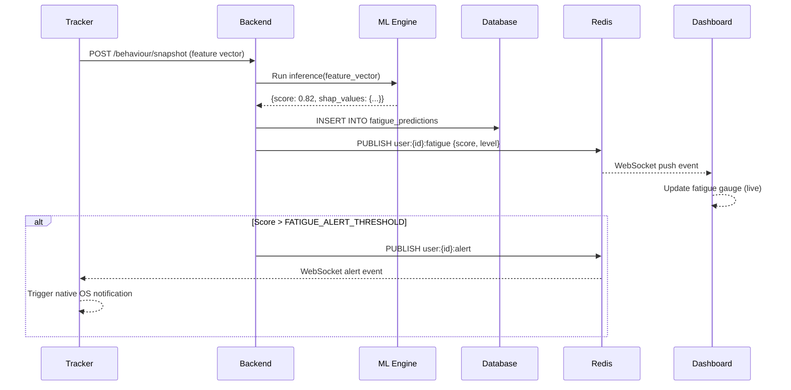

# Architecture

MindGuard is a distributed, asynchronous system designed around three independent concerns: **data collection**, **inference**, and **visualization**. This separation ensures each component can be scaled, updated, or replaced independently.

---

**Navigation:** [← Back to README](../../README.md) | [API Reference](../api/API.md) | [Deployment](../deployment/DEPLOYMENT.md) | [Developer Guide](../developer/DEVELOPER_GUIDE.md)

---

## Table of Contents

- [System Overview](#system-overview)
- [Component Breakdown](#component-breakdown)
- [Data Flow](#data-flow)
- [Machine Learning Pipeline](#machine-learning-pipeline)
- [Security Architecture](#security-architecture)
- [Scalability Notes](#scalability-notes)

---

## System Overview

---

## Component Breakdown

### 1. Desktop Tracker (`/tracker`)

A lightweight Python background agent deployed on the user's workstation.

- **Data Collected:** Keystroke inter-arrival timings, key hold durations, mouse displacement deltas, cursor velocity. **Raw key identities are discarded at the OS hook level.**
- **Aggregation:** Events are buffered and aggregated into 1-second sliding windows. Each window produces a statistical feature vector (24 features) which is transmitted to the backend.
- **Notifications:** Maintains a WebSocket connection to receive real-time fatigue alerts from the backend. On receiving a high-fatigue event, it triggers a native OS desktop notification via `plyer`.
- **Resilience:** Implements exponential backoff for API send failures and offline buffering.

### 2. FastAPI Backend (`/backend`)

An asynchronous REST API responsible for authentication, data persistence, ML orchestration, and WebSocket management.

- **Concurrency:** Built on `asyncio` + Uvicorn. ML inference is dispatched as a background task to prevent blocking the event loop.
- **Authentication:** JWT-based authentication with access tokens (30-minute expiry) and refresh tokens (7-day expiry). Logout immediately blacklists the token JTI in Redis.
- **ML Inference:** The trained model is loaded into memory at startup. Inference is performed synchronously within a background task, producing a prediction and SHAP explanation in < 10ms.
- **WebSocket Scaling:** Uses Redis Pub/Sub to broadcast fatigue events. This allows the backend to scale horizontally across multiple Uvicorn workers while maintaining correct per-user WebSocket delivery.

### 3. React Frontend (`/frontend`)

A TypeScript React application providing the user-facing dashboard and admin panel.

- **State Management:** Zustand for global auth and fatigue state. React Query for server state caching and background refresh.
- **Real-time:** Custom `useWebSocket` hook manages the WebSocket connection lifecycle with automatic exponential backoff reconnection.
- **Charts:** Recharts with custom rendering for fatigue gauges, hourly trend lines, and heatmap matrices.

---

## Data Flow

---

## Machine Learning Pipeline

The offline training pipeline is located in `/scripts/train_models.py` and `/dataset/generator.py`.

### Training Workflow
1. **Data Generation:** Synthetic behavioral data is generated using physiological baselines with controlled noise and fatigue-state degradation patterns.
2. **Feature Engineering:** 24 statistical features are extracted per observation window covering keystroke dynamics, mouse kinematics, and idle time metrics.
3. **Model Evaluation:** Multiple classifiers are trained and evaluated using stratified cross-validation. The model with the highest test F1 score is serialized.
4. **Serialization:** The winning model (`best_model.joblib`), feature scaler (`scaler.joblib`), and feature name manifest (`feature_names.json`) are saved to `ml/models/`.

### Trained Model Results

The following results were measured on a held-out test set from the synthetic dataset.

| Model | Test F1 | Test Accuracy |
|:---|:---:|:---:|
| **LightGBM** (selected) | **0.9373** | **0.9572** |
| XGBoost | 0.9370 | 0.9570 |
| Random Forest | 0.9225 | 0.9201 |
| SVM | 0.8341 | 0.7687 |
| Logistic Regression | 0.7481 | 0.6429 |

> **Note:** These results are from the synthetic dataset. Real-world performance on production behavioral data may differ and should be validated against labeled ground truth.

---

## Security Architecture

| Layer | Control | Implementation |
|:---|:---|:---|
| **Auth** | JWT with short-lived access tokens | 30-minute expiry; 7-day refresh token |
| **Revocation** | Token blacklisting | Redis JTI blacklist checked on every request |
| **Passwords** | Bcrypt hashing | Work factor 12 |
| **Transport** | TLS | HTTPS/WSS enforced in production via Nginx |
| **CORS** | Origin allowlist | Configurable via `CORS_ORIGINS` environment variable |
| **Rate Limiting** | Per-IP rate limiting | SlowAPI middleware (60 req/min general, 10 req/min auth) |
| **Input Validation** | Schema validation | Pydantic models on all request bodies |
| **Privacy** | Edge aggregation | Raw keystrokes never transmitted; only statistical aggregates |

---

## Scalability Notes

- **Backend:** The backend is stateless with respect to WebSockets (using Redis Pub/Sub). Additional Uvicorn workers or backend instances can be added behind a load balancer without coordination.
- **ML Inference:** The model is loaded per-worker process. For high-throughput deployments, inference should be moved to a dedicated model serving process (e.g., Triton Inference Server) communicating via an internal gRPC channel.
- **Database:** Connection pooling is configured via `DATABASE_POOL_SIZE` and `DATABASE_MAX_OVERFLOW`. For production, PostgreSQL read replicas should be configured for analytics queries.
